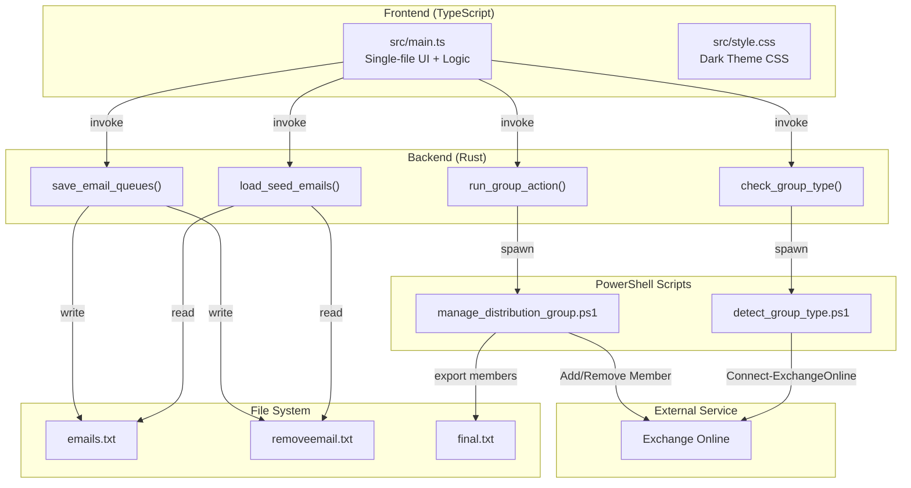

# Trade Union Group Manager — Phân Tích Project & Danh Sách Task

## 1. Tổng Quan Project

**Mục đích:** Desktop app quản lý thành viên **Distribution Group** (Exchange Online). Cho phép thêm/xóa email vào group thông qua 2 hàng đợi (Add Queue & Remove Queue) với giao diện drag-and-drop.

**Tech Stack:**

| Layer | Công nghệ | Phiên bản |
|-------|-----------|-----------|
| Desktop Framework | **Tauri v2** | `^2.1.x` |
| Frontend | **TypeScript + Vite** | TS `^5.6.3`, Vite `^5.4.10` |
| Backend | **Rust** (Tauri commands) | Edition 2021 |
| Automation | **PowerShell** (Exchange Online) | ExchangeOnlineManagement module |
| Build Target | ES2021, Chrome 105, Safari 13 | — |

---

## 2. Cấu Trúc Folder

```
Trade-Union/
├── index.html                        # Entry HTML, load src/main.ts
├── package.json                      # Node deps: @tauri-apps/api, vite, typescript
├── vite.config.ts                    # Vite config, port 1420
├── tsconfig.json                     # TypeScript strict mode, ES2021 target
├── .gitignore                        # Ignore node_modules, dist, target
│
├── src/                              # 🟢 FRONTEND
│   ├── main.ts                       # ~638 dòng – toàn bộ UI + logic (single file)
│   └── style.css                     # ~421 dòng – dark theme, glassmorphism
│
├── src-tauri/                        # 🟠 BACKEND (Rust + Tauri)
│   ├── Cargo.toml                    # Rust deps: tauri 2, serde, serde_json
│   ├── tauri.conf.json               # Window 1200x780, bundle resources
│   ├── build.rs                      # Tauri build script
│   ├── src/
│   │   └── main.rs                   # ~336 dòng – 4 Tauri commands
│   └── scripts/
│       ├── detect_group_type.ps1     # Kiểm tra loại group (Distribution/M365/Security)
│       └── manage_distribution_group.ps1  # Thêm/xóa member qua Exchange Online
│
├── emails.txt                        # Email queue "Add" (seed data)
├── removeemail.txt                   # Email queue "Remove" (seed data)
├── final.txt                         # Export danh sách member sau khi chạy action
├── AddEmailsToDistList.ps1           # Script PowerShell standalone (legacy?)
│
├── public/                           # Static assets (hiện trống)
├── dist/                             # Build output
└── node_modules/                     # Dependencies
```

---

## 3. Kiến Trúc Hiện Tại



---

## 4. Các Tauri Commands (Backend API)

| Command | Chức năng | Status |
|---------|-----------|--------|
| `load_seed_emails` | Đọc `emails.txt` + `removeemail.txt`, trả về 2 danh sách | ✅ Hoàn thành |
| `save_email_queues` | Lưu 2 queue ra file, xử lý trùng lặp | ✅ Hoàn thành |
| `check_group_type` | Gọi `detect_group_type.ps1`, trả về loại group | ✅ Hoàn thành |
| `run_group_action` | Gọi `manage_distribution_group.ps1` để Add/Remove | ✅ Hoàn thành |

---

## 5. Điểm Mạnh & Điểm Yếu

### ✅ Điểm mạnh
- Kiến trúc rõ ràng: Frontend → Rust → PowerShell
- Validation email ở cả 3 tầng (TS, Rust, PS1)
- Drag-and-drop UX trực quan
- Dark theme UI đẹp, responsive
- Group type detection trước khi thao tác

### ⚠️ Điểm yếu / Cần cải thiện
1. **`main.ts` quá lớn (638 dòng)** — chưa tách component
2. **Không có framework UI** — toàn bộ render bằng `innerHTML`
3. **Graph API chưa implement** — chỉ có Exchange PowerShell path
4. **Không có test** — cả frontend lẫn backend
5. **Bundle chưa bật** — `"active": false` trong `tauri.conf.json`
6. **Không có CI/CD** pipeline
7. **Sensitive data** — `emails.txt` / `removeemail.txt` không nên commit lên git
8. **Error handling UI** — chỉ log text, chưa có toast/notification system
9. **File `AddEmailsToDistList.ps1`** — có vẻ legacy, chưa rõ có sử dụng không

---

## 6. Danh Sách Task Để Thiết Lập & Dev

### 🔧 Phase 1: Thiết Lập Môi Trường

| # | Task | Mô tả | Ưu tiên |
|---|------|-------|---------|
| 1.1 | Cài đặt prerequisites | Node.js LTS, Rust toolchain, VS Build Tools (Desktop C++) | 🔴 Bắt buộc |
| 1.2 | `npm install` | Cài frontend dependencies | 🔴 Bắt buộc |
| 1.3 | `npm run tauri dev` | Chạy app ở dev mode, verify Rust compile | 🔴 Bắt buộc |
| 1.4 | ExchangeOnlineManagement | Cài PowerShell module cho Exchange Online | 🟡 Cần khi test thực tế |
| 1.5 | Cấu hình `.gitignore` | Thêm `emails.txt`, `removeemail.txt`, `final.txt` vào ignore | 🟡 Nên làm |

### 🏗️ Phase 2: Refactor & Cấu Trúc Code

| # | Task | Mô tả | Ưu tiên |
|---|------|-------|---------|
| 2.1 | Tách `main.ts` thành modules | Chia thành: `state.ts`, `ui.ts`, `api.ts`, `drag.ts`, `utils.ts` | 🟡 Quan trọng |
| 2.2 | Component-based rendering | Thay `innerHTML` bằng component functions có lifecycle | 🟡 Nên làm |
| 2.3 | Dọn dẹp file legacy | Xác định vai trò `AddEmailsToDistList.ps1`, xóa nếu không dùng | 🟢 Tùy chọn |
| 2.4 | Thêm TypeScript interfaces | Tạo `types.ts` riêng cho shared types | 🟢 Tùy chọn |

### ✨ Phase 3: Tính Năng Mới

| # | Task | Mô tả | Ưu tiên |
|---|------|-------|---------|
| 3.1 | Graph API implementation | Implement execution path "Microsoft Graph" thay vì chỉ Exchange PS | 🟡 Theo roadmap |
| 3.2 | Bulk import từ CSV/Excel | Cho phép import email từ file thay vì paste | 🟢 Nice-to-have |
| 3.3 | View final members | Hiển thị danh sách `final.txt` trong app sau khi chạy action | 🟡 Hữu ích |
| 3.4 | History/Audit log | Lưu lịch sử các lần chạy Add/Remove | 🟢 Nice-to-have |
| 3.5 | Toast notifications | Thay thế text log bằng toast popup cho success/error | 🟡 UX |
| 3.6 | Search & filter email | Tìm kiếm nhanh trong queue khi có nhiều email | 🟢 Nice-to-have |

### 🧪 Phase 4: Testing & Quality

| # | Task | Mô tả | Ưu tiên |
|---|------|-------|---------|
| 4.1 | Unit tests cho Rust | Test `normalize_email`, `sanitize_email_input`, `read/write_email_file` | 🟡 Quan trọng |
| 4.2 | Unit tests cho TypeScript | Test `parseEmails`, `normalizeEmail`, state management | 🟡 Quan trọng |
| 4.3 | Integration test | Test end-to-end flow với mock Exchange Online | 🟢 Nên có |
| 4.4 | Linting & Formatting | Thêm ESLint, Prettier, `cargo fmt`, `cargo clippy` | 🟢 Nên có |

### 📦 Phase 5: Build & Deployment

| # | Task | Mô tả | Ưu tiên |
|---|------|-------|---------|
| 5.1 | Enable bundle | Đổi `"active": false` → `true` trong `tauri.conf.json` | 🟡 Để build installer |
| 5.2 | App icon & metadata | Thêm icon, description cho installer | 🟢 Polish |
| 5.3 | Code signing | Sign app cho Windows | 🟢 Enterprise |
| 5.4 | CI/CD pipeline | GitHub Actions: lint → test → build → release | 🟢 Long-term |
| 5.5 | Auto-update | Tích hợp Tauri updater plugin | 🟢 Long-term |

---

## 7. Lệnh Khởi Chạy Nhanh

```powershell
# 1. Cài dependencies
npm install

# 2. Chạy dev mode (frontend + Rust backend)
npm run tauri dev

# 3. Build production
npm run tauri build
```

> [!IMPORTANT]
> Cần cài đặt **Rust toolchain** và **Visual Studio Build Tools (Desktop C++)** trước khi chạy `npm run tauri dev`. Lần đầu compile Rust sẽ mất 3-5 phút.
