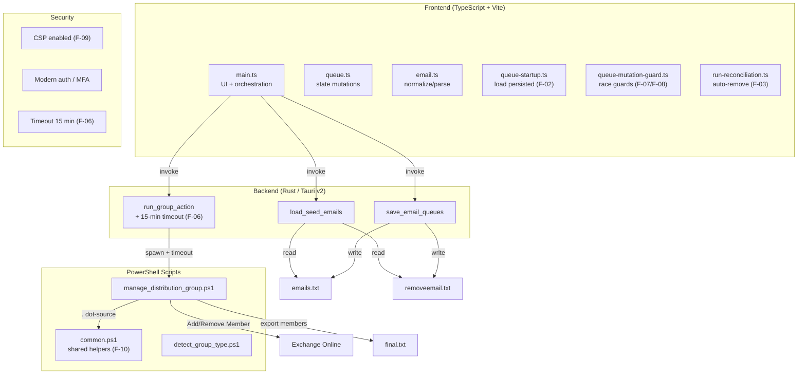

# Trade Union Group Manager — Phân Tích Project & Danh Sách Task

> **Cập nhật 2026-08-09:** Tài liệu này đã được refresh cho phiên bản v2.0.5
> sau khi F-01 → F-11 được giải quyết. Các phần "điểm yếu" cũ đã được gắn nhãn
> **✅ Resolved** hoặc cập nhật phản ánh trạng thái hiện tại. Xem thêm
> `OPTIMISE.md` (finding tracker) và `README.md` (hướng dẫn user) để biết chi tiết.

## 1. Tổng Quan Project

**Mục đích:** Desktop app quản lý thành viên **Distribution Group** (Exchange Online). Cho phép thêm/xóa email vào group thông qua 2 hàng đợi (Add Queue & Remove Queue) với giao diện drag-and-drop.

**Tech Stack:**

| Layer | Công nghệ | Phiên bản |
|-------|-----------|-----------|
| Desktop Framework | **Tauri v2** | `^2.1.x` (CLI 2.10) |
| Frontend | **TypeScript + Vite** | TS `^5.6.3`, Vite `^5.4.10` |
| Backend | **Rust** (Tauri commands) | Edition 2021, rustc 1.96 |
| Automation | **PowerShell** (Exchange Online) | ExchangeOnlineManagement 3.9.2 (bundled offline) |
| Build Target | ES2021, Chrome 105, Safari 13 | — |
| Security | CSP enabled, modern auth (MFA), 15-min timeout | — |

---

## 2. Cấu Trúc Folder (hiện tại)

```
Trade-Union/
├── index.html                        # Entry HTML, load src/main.ts
├── package.json                      # Node deps: @tauri-apps/api, vite, typescript
├── vite.config.ts                    # Vite config, port 1420, strictPort
├── tsconfig.json                     # TypeScript strict mode, allowImportingTsExtensions
├── .gitignore                        # Ignore node_modules, dist, target, queue files
│
├── src/                              # 🟢 FRONTEND (10 modules)
│   ├── main.ts                       # UI template + orchestration (~660 dòng)
│   ├── style.css                     # Dark theme, glassmorphism (~810 dòng)
│   ├── types.ts                      # QueueName, GroupRunResult, ActionDetail, SeedEmails
│   ├── constants.ts                  # Regex, storage keys, TTL, limits
│   ├── email.ts                      # normalizeEmail, parseEmails, sanitizeEmailInput, escapeHtml
│   ├── queue.ts                      # state singleton + add/remove/move mutations
│   ├── storage.ts                    # localStorage/sessionStorage wrappers
│   ├── auth.ts                       # in-memory auth TTL cache (10 min)
│   ├── queue-startup.ts              # resolveInitialQueues — load persisted state (F-02)
│   ├── queue-mutation-guard.ts       # canMutateQueues/canStartRun — race guards (F-07/F-08)
│   └── run-reconciliation.ts         # resolveRemovableEmails — auto-remove logic (F-03)
│
├── src-tauri/                        # 🟠 BACKEND (Rust + Tauri)
│   ├── Cargo.toml                    # Rust deps: tauri 2, serde, serde_json, wait-timeout
│   ├── tauri.conf.json               # Window 1200x780, CSP, bundle resources
│   ├── build.rs                      # Tauri build script
│   ├── src/
│   │   └── main.rs                   # ~700 dòng – 3 commands + timeout runner (F-06)
│   ├── scripts/
│   │   ├── common.ps1                # Shared helpers: module loading + connect params (F-10)
│   │   ├── detect_group_type.ps1     # Standalone group-type probe
│   │   └── manage_distribution_group.ps1  # Add/Remove members + export (dot-sources common.ps1)
│   ├── vendor/powershell-modules/    # Bundled ExchangeOnlineManagement 3.9.2
│   └── installer-hooks/              # NSIS clean-install hook
│
├── tests/                            # 🧪 TESTS
│   ├── email.test.mjs                # Behavioral: email normalize/parse/escape (F-03)
│   ├── queue.test.mjs                # Behavioral: queue transitions (F-03)
│   ├── run-reconciliation.test.mjs   # Behavioral: auto-remove logic (F-03)
│   ├── queue-startup.test.mjs        # Behavioral + wiring: startup load (F-02)
│   ├── queue-mutation-guard.test.mjs # Behavioral + wiring: race guards (F-07/F-08)
│   ├── csp-config.test.mjs           # Contract: CSP security properties (F-09)
│   ├── readme-contract.test.mjs      # Contract: README accuracy (F-11)
│   ├── exchange-module-bundle.test.mjs # Contract: PS bundle + dedup (F-10)
│   ├── clear-bulk-input-ui.test.mjs  # Contract: UI element IDs + CSS classes
│   └── installer-clean-upgrade.test.mjs # Contract: WiX upgradeCode + NSIS hook
│
├── README.md                         # User-facing docs (Tauri-first, F-11 rewrite)
├── OPTIMISE.md                       # Finding tracker F-01→F-20 (8 resolved, 12 open)
├── AGENTS.md                         # Agent guidance (untracked)
└── docs/superpowers/plans/           # Historical design notes (untracked)
```

> **Lưu ý:** `emails.txt`, `removeemail.txt`, `final.txt` nằm trong app data dir
> tại runtime, không trong repo (gitignored). Legacy Python files
> (`cli.py`, `trade_union.py`, `test_trade_union.py`) và `AddEmailsToDistList.ps1`
> đã bị xóa trong F-04.

---

## 3. Kiến Trúc Hiện Tại


```mermaid
graph TB
    subgraph Frontend["Frontend (TypeScript + Vite)"]
        UI["main.ts<br/>UI + orchestration"]
        QUEUE["queue.ts<br/>state mutations"]
        EMAIL["email.ts<br/>normalize/parse"]
        STARTUP["queue-startup.ts<br/>load persisted (F-02)"]
        GUARD["queue-mutation-guard.ts<br/>race guards (F-07/F-08)"]
        RECON["run-reconciliation.ts<br/>auto-remove (F-03)"]
    end

    subgraph Backend["Backend (Rust / Tauri v2)"]
        CMD1["load_seed_emails"]
        CMD2["save_email_queues"]
        CMD3["run_group_action<br/>+ 15-min timeout (F-06)"]
    end

    subgraph Scripts["PowerShell Scripts"]
        COMMON["common.ps1<br/>shared helpers (F-10)"]
        PS1["detect_group_type.ps1"]
        PS2["manage_distribution_group.ps1"]
    end

    subgraph Security["Security"]
        CSP["CSP enabled (F-09)"]
        AUTH["Modern auth / MFA"]
        TIMEOUT["Timeout 15 min (F-06)"]
    end

    UI -->|invoke| CMD1
    UI -->|invoke| CMD2
    UI -->|invoke| CMD3
    CMD1 -->|read| F1["emails.txt"]
    CMD1 -->|read| F2["removeemail.txt"]
    CMD2 -->|write| F1
    CMD2 -->|write| F2
    CMD3 -->|spawn + timeout| PS2
    PS2 -->|. dot-source| COMMON
    PS2 -->|Add/Remove Member| EXO["Exchange Online"]
    PS2 -->|export members| F3["final.txt"]
```

---

## 4. Các Tauri Commands (Backend API)

| Command | Chức năng | Status |
|---------|-----------|--------|
| `load_seed_emails` | Đọc `emails.txt` + `removeemail.txt`, trả về 2 danh sách | ✅ Hoàn thành + frontend gọi lúc startup (F-02) |
| `save_email_queues` | Lưu 2 queue ra file, xử lý trùng lặp | ✅ Hoàn thành |
| `run_group_action` | Gọi `manage_distribution_group.ps1` Add/Remove + timeout 15 phút | ✅ Hoàn thành + F-06 timeout |

> **Ghi chú:** Không có command `check_group_type` — `detect_group_type.ps1` là
> standalone tool, không được Rust invoke trực tiếp (chỉ bundled).

---

## 5. Điểm Mạnh & Điểm Yếu

### ✅ Điểm mạnh
- Kiến trúc rõ ràng: Frontend → Rust → PowerShell (3 tầng tách biệt)
- Validation email ở cả 3 tầng (TS, Rust, PS1)
- Drag-and-drop UX trực quan, dark theme
- Queue persistence: lưu/restore qua restart (F-02)
- Behavioral tests cho email/queue/reconciliation (F-03, 114+ Node tests)
- CSP enabled — chặn XSS→invoke (F-09)
- PowerShell timeout 15 phút + pipe deadlock fix (F-06)
- Queue race guards — không mutate khi run active (F-07/F-08)
- PowerShell helper dedup — common.ps1 shared (F-10)
- Modern auth only (MFA), no credentials stored

### ⚠️ Điểm yếu còn lại (F-13+, xem OPTIMISE.md)
1. **Accessibility** — modal thiếu focus trap, drag-drop mouse-only (F-13, OPEN)
2. **Performance** — `bindDynamicEvents` re-bind O(N) per render (F-14, OPEN)
3. **Performance** — `updateBulkCount` parse mỗi keystroke (F-15, OPEN)
4. **Type safety** — `ActionDetail.status: string` thay vì union (F-16, OPEN)
5. **CI/CD** — chưa có GitHub Actions (F-17, OPEN)
6. **Dead CSS** — rules cho element không tồn tại (F-18, OPEN)
7. **`style-src 'unsafe-inline'`** — bắt buộc vì inline style attributes, candidate hardening future

### ✅ Điểm yếu đã giải quyết (F-01 → F-11)
- ~~Version skew package-lock.json~~ → F-01 Resolved (PR #17)
- ~~Queue wipe on startup~~ → F-02 Resolved (PR #18)
- ~~Không có behavioral tests~~ → F-03 Resolved (PR #19)
- ~~Dead code Python + PS~~ → F-04/F-05 Resolved (PR #20)
- ~~PowerShell no timeout~~ → F-06 Resolved (PR #21)
- ~~Race conditions runAction/drag/delete~~ → F-07/F-08 Resolved (PR #22)
- ~~CSP disabled~~ → F-09 Resolved (PR #24)
- ~~PowerShell helper duplication~~ → F-10 Resolved (PR #25)
- ~~README misleading~~ → F-11 Resolved (PR #26)

---

## 6. Trạng Thái Testing

| Loại | Số test | Framework |
|------|---------|-----------|
| Node behavioral (TS-strip) | ~77 | `node --experimental-strip-types --test` |
| Node contract | ~37 | `node --test` |
| Rust hard-constraint | 14 | `cargo test` |
| PowerShell syntax | 3 scripts | PS Parser (manual) |
| **Tổng** | **~128** | — |

> Không có `npm test` script — chạy test trực tiếp. Xem README.md section Testing.

---

## 7. Lệnh Khởi Chạy Nhanh

```powershell
# 1. Cài dependencies
npm install

# 2. Chạy dev mode (frontend + Rust backend)
npm run tauri dev

# 3. Build production installer
npm run tauri build
```

> [!IMPORTANT]
> Cần cài đặt **Rust toolchain** và **Visual Studio Build Tools (Desktop C++)** trước khi chạy `npm run tauri dev`. Lần đầu compile Rust sẽ mất 1-3 phút.

---

## 8. Ghi Chú Lịch Sử

Tài liệu này được tạo lần đầu cho v1.1 (2026-02-10) khi project chỉ có
`main.ts` + `style.css` (single-file), không có tests, bundle chưa enable.
Sau F-01 → F-11, project đã có:
- 10 frontend modules (tách từ main.ts)
- 128 tests (behavioral + contract + Rust)
- Bundle active + CSP + timeout + race guards
- 3 PowerShell scripts (common.ps1 shared)
- README Tauri-first

Xem `OPTIMISE.md` cho finding tracker chi tiết (F-01 → F-20).
